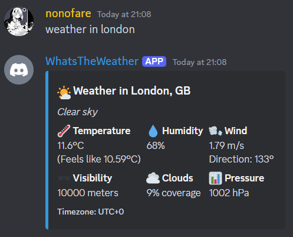

# whats_the_weather

whats_the_weather is a lightweight Discord bot that fetches and displays current weather information using the OpenWeatherMap API. The bot listens for commands in a Discord channel and responds with an embedded message containing detailed weather data.

<div align="center">
  
</div>

---

## Table of Contents

- [Features](#features)
- [Project Structure](#project-structure)
- [Installation](#installation)
- [Configuration](#configuration)
- [Usage](#usage)

---

## Features

- **Discord Integration:** Connects to Discord via the Discord API.
- **Weather Data Retrieval:** Fetches up-to-date weather information using the OpenWeatherMap API.
- **Interactive Commands:** Listens for commands starting with `weather in` to trigger weather lookups.
- **Embedded Responses:** Displays weather details in a visually appealing embedded message.
- **Flexible Configuration:** Supports configuration through CLI arguments or a CSV file.

---

## Project Structure

- **main.py:**
  Initializes the bot by loading API keys from `config.py`, setting up the required Discord intents, and starting the bot with the provided Discord token.

- **DiscordClient.py:**
  Defines the `DiscordClient` class, which extends `discord.Client`. It listens for messages and, upon detecting a command (e.g., `weather in London`), fetches weather data using the `OpenWeatherClient`.

- **OpenWeatherClient.py:**
  Implements the `OpenWeatherClient` class that sends HTTP requests to the OpenWeatherMap API. It processes the response data into a structured format suitable for the Discord embed.

- **config.py:**
  Manages API key retrieval. Keys can be provided as command-line arguments or through a CSV file. The file must contain the required keys: `DISCORD_KEY` and `OPEN_WEATHER_KEY`.

---

## Installation

1. Clone the Repository:
   ```bash
   git clone https://github.com/nonofare/weather-discord-bot.git
   cd weather-discord-bot
   ```
2. Create and Activate a Virtual Environment (Optional but Recommended):
   ```bash
   python -m venv venv
   source venv/bin/activate  # On Windows use: venv\Scripts\activate
   ```
3. Install Required Packages:
   ```bash
   pip install discord requests
   ```

---

## Configuration

The bot requires two API keys:

- **Discord Bot Token:** For connecting to Discord.
- **OpenWeatherMap API Key:** For fetching weather data.

You can provide these keys in two ways:

1. Command-Line Arguments:
   Run the bot with the `-d` and `-w` flags:
   ```bash
   python main.py -d YOUR_DISCORD_TOKEN -w YOUR_OPENWEATHER_KEY
   ```
2. CSV File:
   Create a `keys.csv` file in the project root with the following format:

   ```csv
   KEY,VALUE
   DISCORD_KEY,YourDiscordToken
   OPEN_WEATHER_KEY,YourOpenWeatherAPIKey
   ```

   Then simply run:

   ```bash
   python main.py
   ```

If the keys are missing or not provided correctly, the application will raise an appropriate error.

---

## Usage

Once the bot is running, invite it to your Discord server. Ensure the bot has the necessary permissions to read and send messages in the desired channels. In any text channel where the bot has access, you can type:

```bash
weather in <location>
```

For example:

```bash
weather in New York
```

The bot will respond with an embedded message displaying current weather information for the specified location.
